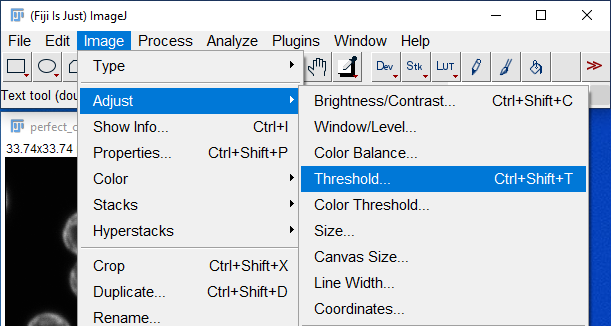

Table of content.

## What to achieve with this code.
This macro was written for FIJI ImageJ ver 1.48. Following the steps ou will be able to separate cells from the confocal microscope dual-images (6-channel + lambda 32 channel).
Each separated cell will later yield infomration about its fluorescence intensities from its inner and outer sections.

## What files are needed (type of data).
You can use both original .czi files as well as stacked .tiff.
Macro requires that there are two files involved, one that is sequential and other that is multi channel lambda.

## Order how to press macros to get correct result.
- [0] Open ImageJ (FIJI).
- [1] Open two images ("6-channel" and "lambda"). Set Color mode to "Composite" and turn OFF "Autoscale".
- [2] Select "6-channel" image and press "1" to set name to variable "image_name".
- [3] Select "lambda" image and press "2" to set name to variable "lambda_name".
- [4] Press "3" to set basic variables and pre-process image.
- (x) In case "ImageMask" looks like it has too little of cells selected (cells not fully selected or partitioned) of too much (cells merged into giant conglomerates) please try using different values of "setThreshold(90, 255);" on line 142. 
- [5] Draw shape on image "ImageMask" that will close cells into individual objects. If cell was wrongly split into two objects - just draw lines to connect it.
- [6] Press "d" to embed drawn shape into image.
- [7] Repeat drawing and pressing "d" until you are happy with your cells being merged correctly.
- [8] Press "4" to allow yourself to draw separation lines. Now you will be drawing on image "drawboard". If your cells are wrongly merged and should be marked as individual objects - draw line that will separate them.
- [9] Press "d" to embed drawn shape into image.
- [10] Repeat drawing and pressing "d" until you are happy with your cells being separated correctly.
- [11] Press "5" to finish analysis.

## Step-by-step guide for processing images.
### [0] Copy folder and its content to your local drive and load macro to ImageJ.
[Link to Folder](sample_czis/ "Open folder.")<br>
Load macro with "Plugins -> Macros -> Install..." and choose macro file "Crososphaera_extraction.txt".<br>
In come cases it might be required to unify settings of ImageJ on your computer to match those used in this macro. To achieve this press "x" after installing macro.<br>
<br>

### [1] Open two images ("6-channel" and "lambda").<br>
<br>

### [2] Set options as shown on picture.<br>
<br>

### [3] Select "6-channel" image and press "1" to set name to variable "image_name".<br>
<br>

### [4] Select "lambda" image and press "2" to set name to variable "lambda_name".<br>
Be aware that on this image channel is set to 19. When you open your image it will be set to 1. This is ok. Keep it at value 1.<br>
<br>

### [5] Press "3" to set basic variables and pre-process image.<br>
This will create new folder inside location where your "image_name" is placed.<br>
<br>
These will be new windows that will appear.<br>
<br>

### [6] Draw shape on image "ImageMask" that will close cells into individual objects. If cell was wrongly split into two objects - just draw lines to connect it.<br>
Draw a line on "ImageMask" image to close cell into single object and then press "d" on keyboard.<br>
In this case selected threshold values allowed decent but far from great cell separation. Next step is to fix it with "draw" method.<br>
This is "ImageMask" image that you will be drawing on using "freehand" tool. It will be automatically selected for you.<br>

<br><br>

Goal here is to ensure that everything that you want to classify as cell will be enclosed space.<br>
Later step in this macro will be "Fill Holes", and we have to make each cell of our interest not having holes.<br>
You can see single cell (bottom-left most cell) here being closed and then embeded with final line. You can see that upon drawing line is a bit thinner (and red) than final line being drawn. This might depend on your ImageJ setting so you can edit it to your liking (both thickness and color). Next image is finalized closing of cell already.<br>

<br>

Here is example shown on one cell how it looks at the start [1] then after drawing closing line [2], after pressing letter "d" on keyboard [3] and finally after de-selecting overlay [4].<br>
 &nbsp; &nbsp; &nbsp; <br>


Goal is to turn cell on the left to the cell on the right. This MASK that we are creating will tell ImageJ what is a cell and what is not a cell.<br>
 &nbsp; &nbsp; &nbsp; <br>

Keep drawing and closing each cell that you are interested in by using "draw" method with "d" key press.

### [7] Finishing closing cells with "draw" method.<br>
After you finished closing all cells the image should look more-less like this.<br>
<br>

### [8] Separating cells that are incorrectly joined.<br>
Some of your cells migh have been wrongly joined together when threshold values are not perfect (as they never will be for all images if you do not use dynamic threshold).<br>
To fix such bad connection you just draw on the image "ImageMask" line that will separate such cells and then use "erase" method by presing "e" on keyboard.<br>
 &nbsp; &nbsp; &nbsp; <br>

You continue drawing lines and using "erase" method until you separate all the cells that are visually easy to separte and end in such image.<br>
<br>

Some cells are merged in such way that it is really hard to tell from mask image where one cell starts and other ends. Like in this image.<br>
<br>
We will adress it in next step. For now - when you are done closing and separating cells (that are easilly separated) - press [4] on keyboard.

### [9] Separating cells that are incorrectly joined - with visual aid.<br>
Now you should see that image "ImageMask". has changed color to white and new image "drawboard" has appeared.<br>
 &nbsp; &nbsp; &nbsp; <br>
Image "drawboard" allows you to see more detailed cell structures as it is your micriscopy image and not mask one.<br>
You can draw lines directly on "drawboard" image to separete cells that were clumped together. After you draw the line press "d" on keyboard to draw it permanently on the "ImageMask".<br>
 &nbsp; &nbsp; &nbsp;  &nbsp; &nbsp; &nbsp; <br>
Finally your "drawboard" and "ImageMask" images should look like this.<br>
 &nbsp; &nbsp; &nbsp; <br>
Do not worry about small "triangles" left in between cells. This will be ignored as they are not cell shaped and rather small. If for some reason these shapes that are not cells are still being included in final cell count you can adjust your ImageJ settings in "Analyze -> Analyze Particles..."<br>
<br>
Other option is to alter code on line on line 233. In case your cells are more cylindrical than oval then you have to find parameters of circularity that fit you.<br>
```java
run("Analyze Particles...", "size=2-Infinity circularity=0.20-1.00 display exclude clear add");
```
Also pay attention that here size is reffered to "2" as in 2 square micrometers. If your image does not have information about pixel size then you might set it manually in ImageJ. Other option can be to alter "AnalyzeParticles" to use pixel values instead of actual size. In example as such size would start from 180 pixels.<br>
```java
run("Analyze Particles...", "size=180-Infinity pixel circularity=0.20-1.00 display exclude clear add");
```
### [10] Final steps.<br>
After you have separated all cells and are happy with how image loos you can press "5" to finish analysis.<br>
Your folder where your original images are localized should have folder with name of your file. <br>
<br>
Inside of this folder you will find such files.<br>
<br>
Here you will find all the results and images for future inspections.<br>


<br><br><br><br>
### [XXX] In case "ImageMask" looks like it has too few cells selected (cells are merged into a giant conglomerates) or too many cells (cells are partitioned or not selected as whole) you can try using different values of "setThreshold(90, 255);" on line 142.

It will be hard finding perfect threshold values for your images. Since some images can be different than another - single pair of threshold values might not fit all of them. For that case - "draw" method will allow you to separate and merge them on the go. Find close enough or working in more cases pair of threshold values and rest can be fixed on the go with the "draw" method.<br>

You can try finding right values for yourself by clicking on image "perfect_copy" and then navigate to: "Image -> Type -> RGB Color".<br>
<br><br>
This new constructed image ("perfect_copy (RGB)") has to be turned back to 8-bit image.<br>
<br><br>

Resulting in such greyscale image.<br>
<br><br>

Preparing to find pair of threshold values.<br>
<br><br>

By moving both bars left and right you can find values that will fit your images best.<br>
<br><br>

When you find values that will separate your cells best way (in this case selected 90 and 255) you can input them into macro file on line 142.<br>
```java
setThreshold(90, 255);
```